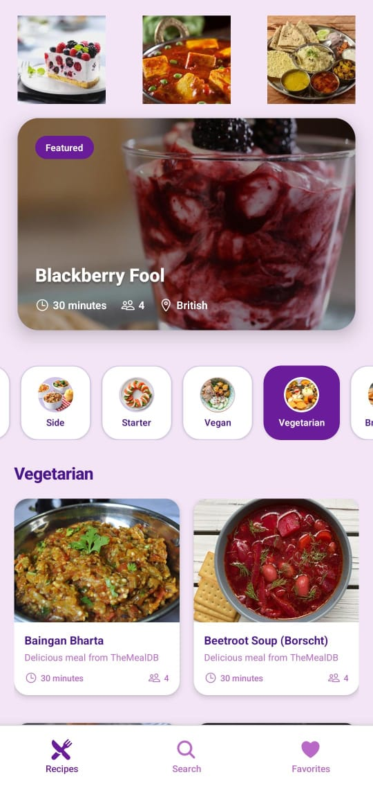
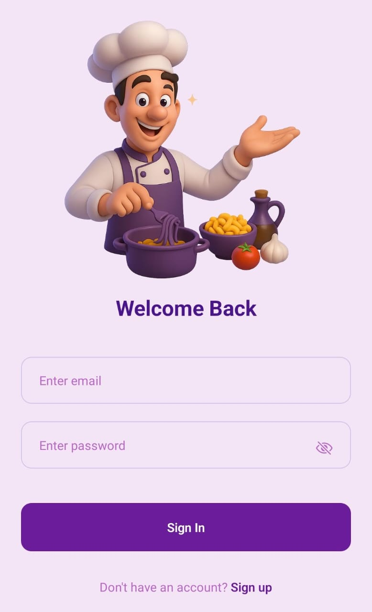
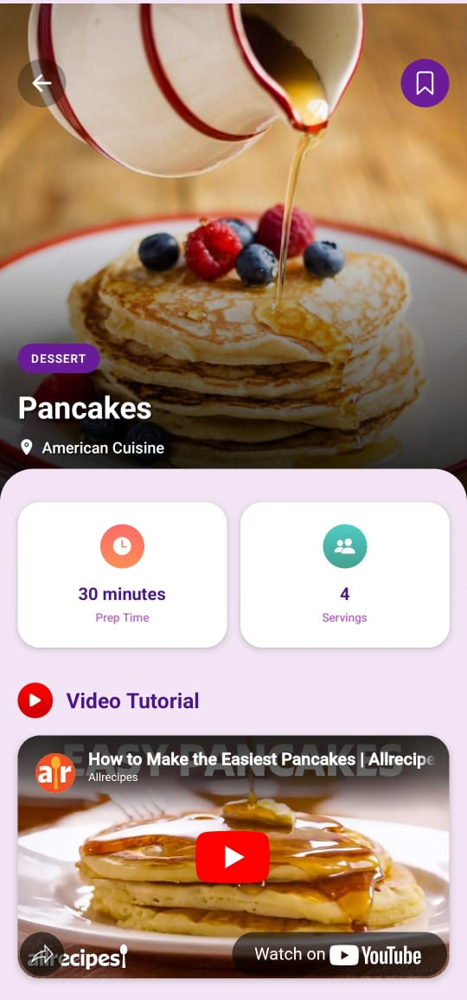

<h1 align="center">🍽️ React Native Recipe App 🍽️</h1>


<p align="center">
  
  &nbsp; &nbsp; &nbsp;
  
  &nbsp; &nbsp; &nbsp;
  
</p>


A simple, beautiful mobile app to discover, search, and save your favorite recipes.


## ✨ **Purpose of the App**


RecipeApp helps food lovers easily discover new recipes, search dishes by name, and save favorites for later.
Users can sign up, sign in, and verify their email securely.
The app connects to a backend server with a real database and API to fetch up-to-date recipes and manage user data.


**Highlights:**

- 🔐 Signup, Login, and 8-Digit Email Verification with **Clerk**
- 🍳 Browse Featured Recipes & Filter by Categories
- 🔍 Search Recipes and View Detailed Cooking Instructions
- 🎥 Recipe Pages Include YouTube Video Tutorials
- ❤️ Add Recipes to Favorites and Access Them from Favorites Tab
- ⚡ Tech Stack: React Native + Express + PostgreSQL + Expo
- 🌈 Includes 8 Color Themes

___

🛠 Tech Stack


-Frontend: React Native, Expo, JavaScript, Expo Router

-Backend: Node.js, Express.js, Drizzle ORM, Cron Jobs

-Database: SQL-based (SQLite / PostgreSQL)

-Others: Expo Go, React Native Stylesheets, custom hooks, environment variables


## 🔗 **How It Works**

- 📱 **Frontend:** Users interact with the mobile app screens built in React Native.
- 🌐 **API:** The app makes requests through `services/mealAPl.js` to the backend.
- 🗄️ **Backend:** Express handles API routes, queries the database, and returns data.
- 🧩 **Database:** Recipes, user accounts, and favorites are stored in a SQL DB.
- 🔁 **Cron Jobs:** Automatically handle tasks like syncing or cleaning data if needed.


---

🚧 Installation & Running Locally

## .env Setup

### Backend (`/backend`)

```bash
PORT=5001
DATABASE_URL=your_neon_db_url
NODE_ENV=development
```

### Mobile App (`/mobile`)

```bash
EXPO_PUBLIC_CLERK_PUBLISHABLE_KEY=your_clerk_publishable_key
```

---

## 🔧 Run the Backend

```bash
cd backend
npm install
npm run dev
```

## 📱 Run the Mobile App

```bash
cd mobile
npm install
npx expo start
```


## 📚 **What I Learned**


✅ Breaking the app into reusable components & screens

✅ Connecting mobile frontend with backend APIs

✅ Managing authentication flow securely

✅ Using Drizzle ORM for clean DB management

✅ Scheduling tasks with Cron jobs

✅ Working with GitHub for version control & collaboration


___


## ⚡ **Key Features**

- 🔐 User Authentication (Sign Up, Sign In, Verify Email)
- 🔍 Search Recipes with Debounced Input
- 📃 View Detailed Recipe Information
- ❤️ Save & View Favorite Recipes
- 📂 Filter Recipes by Category
- 📱 Beautiful, mobile-friendly UI


<p align="center"> ⭐ Feel free to fork, star, and contribute! ⭐ <br/> 📬 For questions, open an issue or reach out! </p> <p align="center"> 👨‍🍳✨ Happy Cooking & Happy Coding! 👨‍🍳✨ </p> 


<p align ="center"> 🙌 Thank You! !


